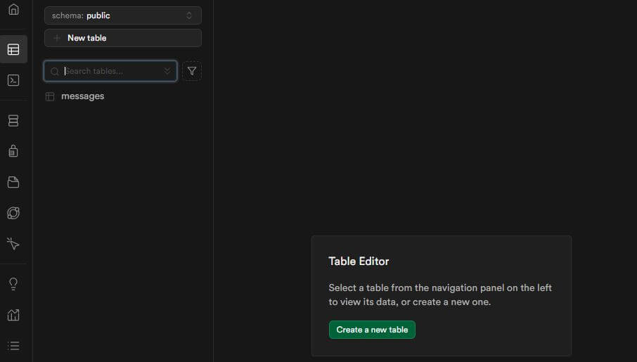
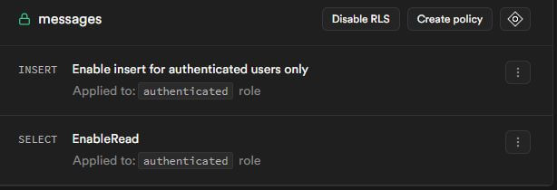
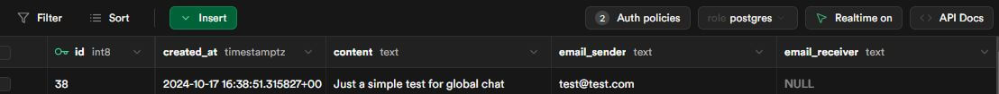
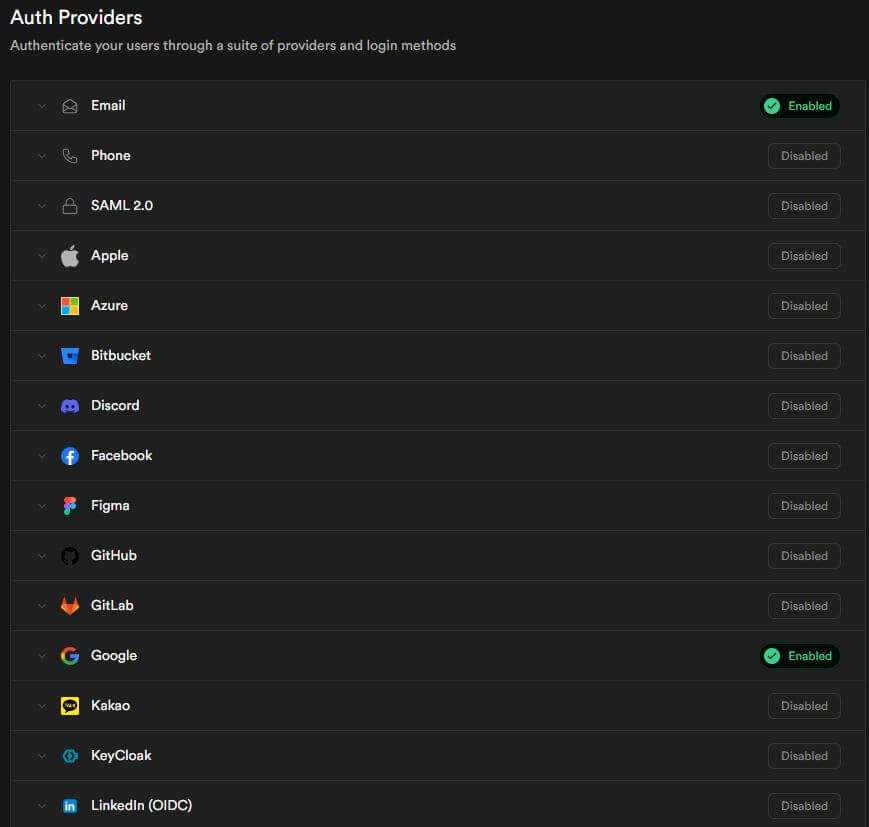
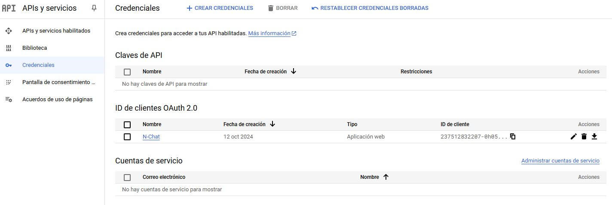
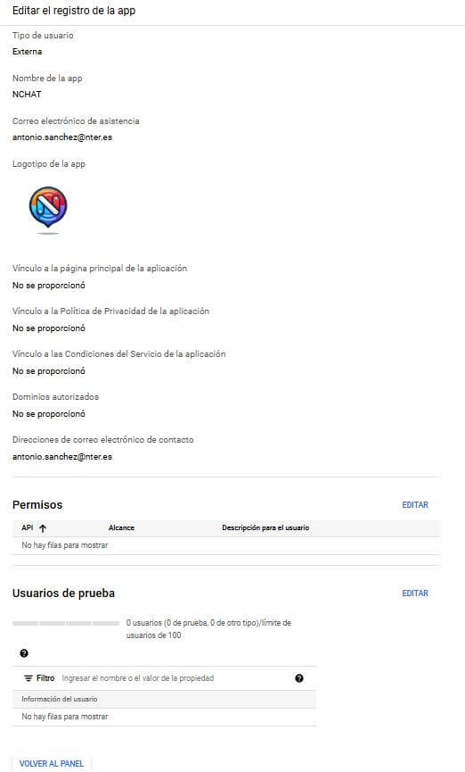
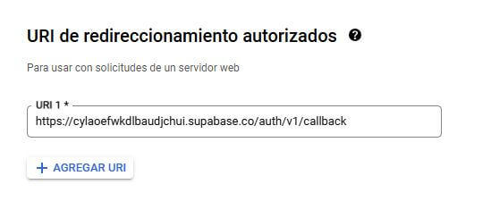
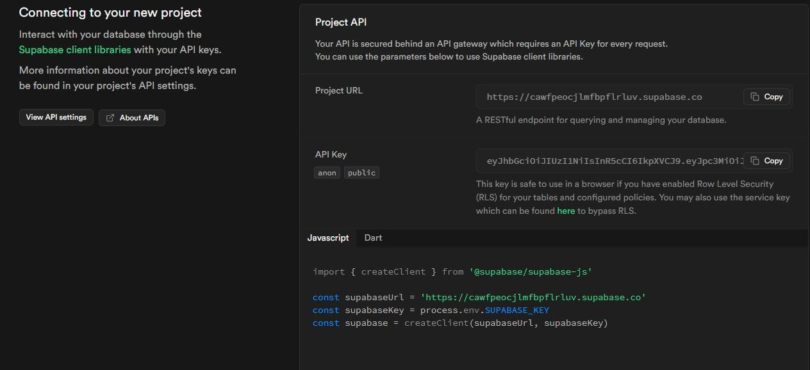

# How to set your supabase serverless and google 0Auth up

## Step 1: Set Up Supabase Account

Go to <https://supabase.io> and sign up for a new account. Once signed in, create a new project and select a region for your database. Supabase will automatically create a PostgreSQL database for you. Although, through this guide you will be able to pick the right settings and make them work. Generally speaking, Supabase docs are quite well written and you should follow them in order to simplify your workflow, especially for seeing how to use their API (as it won't be covered here). As always, don't forget RTFM.

## Step 2: Create a Table for Messages

In your Supabase dashboard, navigate to the 'Database' tab. Go to the 'Tables' section and create a new table named 'messages' or whatever the name you would like to use across the project. Add columns such as 'id' (UUID, primary key), created_at (timestamptz), 'email_sender' (text), 'email_receiver' (text, allowing NULL), and 'content' (text). Optionally, you can add any other column that you believe useful for your project.



## Step 3: Set Permissions for the Messages Table

In the Supabase dashboard, go to the 'Auth Policies' tab. Click on create a new policy for each action you would like to allow (Insert, Select, Update, Delete). For basic chat functionality, allow all authenticated users to insert and select messages. For doing so, you can choose between using a SQL query terminal or the UI provided by Supabase. After finishing this step, you will have a table with the permissions set up for the actions you want to allow. So, it could be a good moment to test the permissions by trying to insert a new message in the table from your site. Be aware that you will need to authenticate your user before doing so.



## Step 4: Enable Realtime Functionality

To allow your chat application to receive real-time updates, go to your 'Table Editor' and click on the 'Realtime' at the top-right of supabase UI. Enable the 'Realtime' feature for the 'messages' table. This will allow your application to listen for changes in the table, such as new messages being added.



## Step 5: Set Up Supabase Authentication

Navigate to the 'Auth' tab in your Supabase dashboard and choose 'Providers'. Enable 'Google' as a provider. You will need to configure this by providing your Google Client ID and Client Secret, which you will obtain from the Google Cloud Console.



## Step 6: Configure Google Cloud Console for OAuth

Go to <https://console.cloud.google.com> and create a new project. Navigate to 'APIs & Services' > 'Credentials' and create an OAuth 2.0 Client ID. Set the application type as 'Web application' and provide the authorized redirect URIs (from your Supabase dashboard). Copy the Client ID and Client Secret and paste them back into your Supabase dashboard under the Google provider settings. Across the process, you will need to confirm several screen prompts. Important, pick external users and just click continue when asked about the test users list. It won't be necessary for this project.





## Step 7: Connect the Frontend to Supabase

Install the Supabase client in your frontend project by running 'npm install @supabase/supabase-js'. Initialize the Supabase client with your Supabase URL and anon public key. It's highly recommended to keep those keys as a secret, saving them into a '.env' file and avoid pushing them to a public repository. Use the authentication methods provided by Supabase to allow users to log in via Google. What should I include in my '.env' file? You should include the Supabase URL and the Supabase public key. You can find them in your Supabase dashboard.



## Step 8: Fetch and Send Messages

Use Supabase's JavaScript library to fetch messages from the 'messages' table. Set up a function to insert new messages into the table when a user sends a message. Use Supabase's realtime subscription feature to listen for new messages and update the chat in real time.

## Step 9: Deploy Your Application

Once your application is ready, deploy it using a service like Vercel, Netlify, or another preferred hosting platform. Make sure your environment variables for Supabase URL and anon key are properly set up in your hosting platform. If you would like to follow same steps as me, using netlify to deploy your app. You should take into consideration that netlify will need an extra file placed in your '/dist' folder named '_redirects' to proper handler the routing of your SPA.

In the '_redirects' file you have to add the following line in order to force the hosting to always send back to the main index.html file:

```sh
/*    /index.html   200
```

## Step 10: Test Your Chat Application

Test the chat functionality by signing in with different Google accounts and exchanging messages. Ensure that private messages are displayed correctly and that global messages are visible when no receiver is specified.
